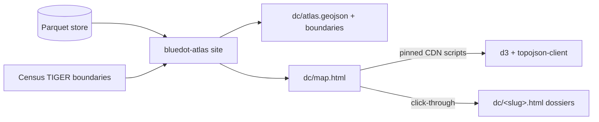

# The map ships inside the compiled site: d3-geo over compiled GeoJSON, in Basin's map idiom

**Date:** 2026-09-02 · **Status:** Proposed · **Scope:** Blue Dot rendering (Data Center Atlas first) · **Brief:** docs/briefs/08-site-v0.md (extends it); design deck v2 mockup 02 (the explore canvas) is the *later* stage this deliberately does not decide.

The interactive map is another compiled page: `bluedot-atlas site` bakes the
entity registry into GeoJSON, and `dc/map.html` renders it with d3-geo +
topojson-client (pinned CDN scripts) over embedded Census boundary geometry —
the exact stack and design idiom of Basin's story maps, which Kevin named as
the target ("emulate the type and design of the geographical/map visualizations
used in ~/projects/basin"). No tile service, no external requests at view time,
no JS toolchain, no framework — the page is fully self-contained, the strongest
possible provenance posture. MapLibre + PMTiles remains the designated path for
street-level context or very large point counts (it is what Basin itself uses
for its 333k-point rights map); the framework question stays with the
explore-canvas decision.

**Design doctrine (revised 2026-09-03 after two mockup rounds):** Blue Dot maps
adopt Basin's `docs/MAP_DESIGN.md` doctrine wholesale — one view one message,
one saturated hue per view (hero layer; everything else recedes), mark
vocabulary capped at graduated circles + lines + text, figure-ground near-white
(county boundaries whisper, states one step darker), halo'd labels
(`paint-order: stroke`), verb-led headlines, annotations on the map carrying
the argument, tooltips as bonus color, zoom-dependent detail, still at rest.
Light cartographic ground only (Kevin rejected space-dark); true aspect always
(AlbersUsa nationally, conic fitted for regions).

## 1. Use cases and problems

- Use case: Kevin (or any reader) seeing the national point cloud — 838
  facilities — and recognizing the story instantly: the Northern Virginia
  wall, the Columbia River cluster, the Phoenix ring.
- Use case: zooming into Prince William County and watching the pipeline —
  operating buildings, entitled-but-empty zoning sites, GFA-scaled — the
  85M-vs-13M sqft fact as a picture instead of a table.
- Use case: clicking any dot → its dossier page (the map navigates; the
  dossier is the truth surface).
- Problem: the atlas is tables on a page ("Ah man...I really wanted to
  render and beautifully visualize this data on an interactive map"). A
  geographic dataset without a map undersells everything underneath it.

## 2. Why

The vision brief names spatial rendering as a core differentiator
("spatially rendered... time-scrubbing choropleths are the demo
centerpiece") and lists MapLibre/deck.gl as the intended lane. The Data
Center Atlas is the first dataset where every entity has coordinates, so it
is the natural first map. Doing nothing leaves the site's front door
underselling the project's actual differentiator. Deciding the *whole*
rendering stack now, though, would front-run the explore-canvas brief — so
this record decides the smallest durable piece: how a map gets onto the
compiled site.

## 3. Proposed solution

`site.py` gains three outputs: `dc/atlas.geojson` (every DC entity: point,
name, stage token + bucket, source, floor area, dossier href — same
latest-vintage discipline as the dossiers), a boundaries file (Census
cartographic state/county geometry, fetched at build time and committed like
a fixture — TIGER direct, not the us-atlas repackage), and `dc/map.html`.
The page loads `d3` and `topojson-client` from pinned CDN `<script>`s and
renders two views in the Basin idiom: national (AlbersUsa, county-line
whisper ground, one-hue graduated dots, chips choosing the hero bucket,
d3-zoom with zoom-dependent city labels, on-map annotation into Northern
Virginia) and county (conic fit to Prince William, study-area tint,
fill-vs-ring encoding for built-vs-paper floor area, data-computed
annotation). Hover tooltips carry the record; every mark clicks through to
its dossier. The interactive mockup at
https://claude.ai/code/artifact/5afbf4aa-47e9-4403-98ac-9fdee330e444 is this
design running against the real 838-entity store.

**High-level design.**

**Out of scope.** The explore canvas (bitemporal scrubbing, Δ-between-
beliefs lens, deck.gl layers, any framework/toolchain adoption) — that
remains its own brief and decision. Choropleths over ACS/PEP counties
(needs boundary geometries — NHGIS work, Stage 1). Mobile-app anything.

## 4. Options considered

| Option | Description | Pros | Cons |
|---|---|---|---|
| **A. d3-geo + topojson, Basin's story-map stack** (chosen) | Compiled static page; pinned CDN scripts; embedded Census boundaries; Basin's MAP_DESIGN doctrine | Kevin's named target, proven in Basin; fully self-contained (no tile service, no view-time requests); zero toolchain; byte-stable; the point cloud IS the message at this scale | SVG marks cap out around a few thousand points; no street-level context (roads/terrain) until the MapLibre stage |
| A′. MapLibre GL JS + keyless tile basemap | The prior draft of this record | Street-level context; scales to huge point counts; deck.gl composes | Third-party tile service at view time; default-web-map look Kevin rejected in mockup review; Basin itself reserves it for the 333k-point layer | 
| B. Basin-style Next.js app | Migrate the site to a framework app like Basin | Kevin knows the shape; rich interactivity; room to grow | Rewrites the whole site architecture for one page; abandons "compiled, no server" identity; front-runs the explore-canvas decision; heavy on the 8GB laptop |
| C. kepler.gl embed | Drop kepler.gl in with the data | Instant rich UI | The design deck's explicit target is *beyond* kepler; huge bundle; not provenance-first; unbrandable |
| D. Do nothing | Keep tables + dossiers | Zero cost | The one thing Kevin asked for stays missing; geographic data without a map |

A wins because it is the design Kevin pointed at, proven in Basin, and the
most self-contained option — the compiled site stays free of view-time
third-party dependencies. A′ (MapLibre) becomes the designated escalation
when street-level context or >~5k simultaneous points arrive, mirroring
Basin's own d3-for-story / MapLibre-for-mass split. B would win only if the
explore-canvas brief concludes the whole site should become an app.

## 5. Design principles

- The map is a compiled artifact: data baked at build time, byte-stable,
  no runtime queries.
- The map navigates; the dossier is the truth surface. Every dot links to
  its dossier; no fact appears on the map that the dossier can't back.
- Provenance on the canvas: vintage + source chip visible on the map, same
  as every page (ADR-0010).
- One saturated hue; lifecycle *buckets* (built / construction / paper /
  closed) choose the hero via chips, never four simultaneous colors. The
  exact per-source stage lives in the tooltip and the dossier — source
  vocabularies are bucketed for display, never merged in the store
  (ADR-0015), and the bucket mapping is declared in code, not inferred.
- **Light cartographic ground** (Kevin, 2026-09-03): paper-white map, light
  fills, hairline boundaries, tinted study areas, muted marks — the Basin
  register, coherent with the site's paper ground. The design deck's
  space-dark treatment is *not* used for maps; whether it survives at all
  is the explore-canvas brief's question.
- True aspect always: standard-parallel-corrected projection, view height
  derived from the map's real proportions — the country is never stretched.
- No API keys, no accounts, in v1.
- Pin exact versions of anything loaded from a CDN.

## 6. Risks

| Risk | Likelihood / impact | Mitigation | Early signal |
|---|---|---|---|
| CDN script unavailable or tampered | low / med | Pin exact versions + SRI hashes; page degrades to a "map unavailable" notice, dossiers unaffected | Map fails to init |
| SVG performance as sources grow | med / med | The A′ escalation: hero layer moves to MapLibre/canvas past ~5k points | Frame drops while zooming the national view |
| Vanilla-JS map page accretes features and turns to soup | med / med | Hard scope: points, popups, stage/source filter chips — anything more reopens this record | A second `<script>` block appears |

## 7. Consequences and revisit triggers

Easier: every future source with coordinates lands on the map by re-running
the compiler; the GeoJSON contract becomes the interchange format the
explore canvas can also consume. Harder: sophisticated interactivity
(time scrubbing, linked views) stays out of reach until the canvas
decision. **Revisit when:** the explore-canvas brief is written; or the map
needs bitemporal scrubbing or >50k points (deck.gl overlay moment); or
choropleth layers arrive with NHGIS boundaries.

**Dependency ask (house rule):** `d3` (7.9.0) and `topojson-client` (3.x)
as pinned CDN runtime scripts — no npm, no package.json, no external
services at view time. Census TIGER boundary geometry is fetched once at
build time from the agency of record. Needs Kevin's approval before the
build (merging this PR is that approval).

---

*Rules of use: one file per decision at `docs/decisions/YYYY-MM-DD-<slug>.md`, listed in `docs/decisions/README.md`. Written before the build and read by Kevin first. Append-only: to change a decision, add a new record that supersedes this one and set this one's status to Superseded. The PR that implements the decision links this file.*
