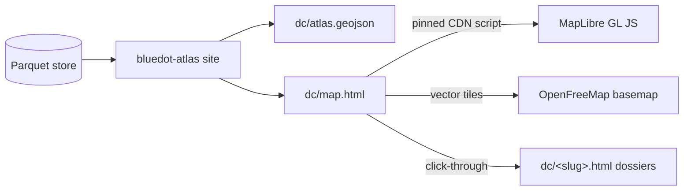

# The map ships inside the compiled site: MapLibre over compiled GeoJSON, no framework

**Date:** 2026-09-02 · **Status:** Proposed · **Scope:** Blue Dot rendering (Data Center Atlas first) · **Brief:** docs/briefs/08-site-v0.md (extends it); design deck v2 mockup 02 (the explore canvas) is the *later* stage this deliberately does not decide.

The interactive map is another compiled page: `bluedot-atlas site` bakes the
entity registry into GeoJSON, and `dc/map.html` renders it with MapLibre GL JS
loaded from a pinned CDN script over a keyless vector basemap. No JS toolchain,
no framework, no server — the site's static, byte-stable identity holds. deck.gl
and any framework question are deferred to the explore-canvas decision, and
MapLibre is chosen partly *because* deck.gl composes with it as an overlay later.

## 1. Use cases and problems

- Use case: Kevin (or any reader) seeing the national point cloud — 838
  facilities — and recognizing the story instantly: the Northern Virginia
  wall, the Columbia River cluster, the Phoenix ring.
- Use case: zooming into Prince William County and watching the pipeline —
  operating buildings, entitled-but-empty zoning sites, GFA-scaled — the
  85M-vs-13M sqft fact as a picture instead of a table.
- Use case: clicking any dot → its dossier page (the map navigates; the
  dossier is the truth surface).
- Problem: the atlas is tables on a page ("Ah man...I really wanted to
  render and beautifully visualize this data on an interactive map"). A
  geographic dataset without a map undersells everything underneath it.

## 2. Why

The vision brief names spatial rendering as a core differentiator
("spatially rendered... time-scrubbing choropleths are the demo
centerpiece") and lists MapLibre/deck.gl as the intended lane. The Data
Center Atlas is the first dataset where every entity has coordinates, so it
is the natural first map. Doing nothing leaves the site's front door
underselling the project's actual differentiator. Deciding the *whole*
rendering stack now, though, would front-run the explore-canvas brief — so
this record decides the smallest durable piece: how a map gets onto the
compiled site.

## 3. Proposed solution

`site.py` gains two outputs: `dc/atlas.geojson` (every DC entity: point,
name, stage token, source, dossier href — same latest-vintage discipline as
the dossiers) and `dc/map.html` (a compiled page like every other). The page
loads `maplibre-gl` from a pinned CDN `<script>`, styles stage-colored
circles from the GeoJSON (GFA-scaled at county zooms via style expressions),
filters by stage/source with chips that toggle layer filters, and opens a
popup linking to the dossier. Basemap: OpenFreeMap's public vector tiles
(keyless, MapLibre-native); if reliability disappoints, swap to a
self-hosted Protomaps PMTiles basemap served from the same Vercel project —
the style JSON is the only thing that changes.

**High-level design.**

**Out of scope.** The explore canvas (bitemporal scrubbing, Δ-between-
beliefs lens, deck.gl layers, any framework/toolchain adoption) — that
remains its own brief and decision. Choropleths over ACS/PEP counties
(needs boundary geometries — NHGIS work, Stage 1). Mobile-app anything.

## 4. Options considered

| Option | Description | Pros | Cons |
|---|---|---|---|
| **A. MapLibre GL JS, CDN script, compiled GeoJSON** (chosen) | `dc/map.html` as another compiled static page; pinned `<script>`; keyless basemap | Zero toolchain; keeps byte-stable compiled-site identity; brief already names MapLibre; deck.gl composes on top later; ships in one slice | Vanilla-JS page (no components) will get unwieldy if the map grows many features; basemap is a third-party dependency |
| B. Basin-style Next.js app | Migrate the site to a framework app like Basin | Kevin knows the shape; rich interactivity; room to grow | Rewrites the whole site architecture for one page; abandons "compiled, no server" identity; front-runs the explore-canvas decision; heavy on the 8GB laptop |
| C. kepler.gl embed | Drop kepler.gl in with the data | Instant rich UI | The design deck's explicit target is *beyond* kepler; huge bundle; not provenance-first; unbrandable |
| D. Do nothing | Keep tables + dossiers | Zero cost | The one thing Kevin asked for stays missing; geographic data without a map |

A wins because it delivers the map while changing nothing about the site's
architecture, and it is forward-compatible with the ambitious path (deck.gl
overlays on MapLibre; a framework can adopt the same GeoJSON contract). B
would win only if the explore-canvas brief concludes the whole site should
become an app — a decision worth making there, not here.

## 5. Design principles

- The map is a compiled artifact: data baked at build time, byte-stable,
  no runtime queries.
- The map navigates; the dossier is the truth surface. Every dot links to
  its dossier; no fact appears on the map that the dossier can't back.
- Provenance on the canvas: vintage + source chip visible on the map, same
  as every page (ADR-0010).
- Stage colors encode each source's own vocabulary; county and EPA stages
  are never merged into one fake taxonomy (ADR-0015 discipline, visually).
- **Light cartographic ground** (Kevin, 2026-09-03): paper-white map, light
  fills, hairline boundaries, tinted study areas, muted marks — the Basin
  register, coherent with the site's paper ground. The design deck's
  space-dark treatment is *not* used for maps; whether it survives at all
  is the explore-canvas brief's question.
- True aspect always: standard-parallel-corrected projection, view height
  derived from the map's real proportions — the country is never stretched.
- No API keys, no accounts, in v1.
- Pin exact versions of anything loaded from a CDN.

## 6. Risks

| Risk | Likelihood / impact | Mitigation | Early signal |
|---|---|---|---|
| OpenFreeMap outage/throttling | low / med | Style-JSON swap to self-hosted Protomaps PMTiles on the same Vercel project | Tile 4xx/latency in the browser console |
| CDN script unavailable or tampered | low / med | Pin exact version + SRI hash; page degrades to a "map unavailable" notice, dossiers unaffected | Map fails to init |
| Vanilla-JS map page accretes features and turns to soup | med / med | Hard scope: points, popups, stage/source filter chips — anything more reopens this record | A second `<script>` block appears |
| Basemap tiles make the page feel third-party | low / low | Muted light cartographic style (Positron-class) restyled to the site's paper palette | It looks like a default web map |

## 7. Consequences and revisit triggers

Easier: every future source with coordinates lands on the map by re-running
the compiler; the GeoJSON contract becomes the interchange format the
explore canvas can also consume. Harder: sophisticated interactivity
(time scrubbing, linked views) stays out of reach until the canvas
decision. **Revisit when:** the explore-canvas brief is written; or the map
needs bitemporal scrubbing or >50k points (deck.gl overlay moment); or
choropleth layers arrive with NHGIS boundaries.

**Dependency ask (house rule):** `maplibre-gl` as a pinned CDN runtime
script (no npm/package.json), and OpenFreeMap public tiles as an external
service. Both need Kevin's approval before the build.

---

*Rules of use: one file per decision at `docs/decisions/YYYY-MM-DD-<slug>.md`, listed in `docs/decisions/README.md`. Written before the build and read by Kevin first. Append-only: to change a decision, add a new record that supersedes this one and set this one's status to Superseded. The PR that implements the decision links this file.*
