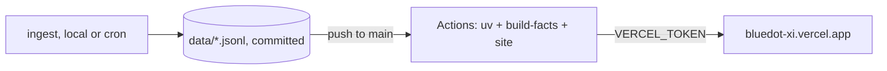

# The conformed store is committed, and CI compiles and deploys the site

**Date:** 2026-09-04 · **Status:** Proposed · **Scope:** deployment pipeline + what lives in git · **Brief:** docs/briefs/08-site-v0.md queued this follow-up ("moving the build+deploy into CI").

Commit the conformed JSONL store (`data/facts|entities|claims|geometry/`,
~43MB today) to the repo, and let GitHub Actions rebuild and deploy the
site on every push to `main` — so merges ship without a laptop, and the
repo becomes what it already claims to be: the source of truth.

## 1. Use cases and problems

- Use case: a merged PR (including the monthly snapshot PR) is live on
  bluedot-xi.vercel.app minutes later, no manual `bluedot-atlas site` +
  `vercel deploy` on Kevin's machine.
- Use case: the monthly cron's snapshot merge automatically refreshes the
  map's land bays and dossiers in production — the cadence loop closes.
- Problem: today every deploy routes through one laptop with the CLI
  logged in; a merge while it's closed ships nothing.
- Problem: `data/` is gitignored, so a fresh clone cannot build the site
  at all — the store exists only on one machine (and partially in
  `snapshots/`).

## 2. Why

Brief 08 explicitly queued this. Blue Dot's constitution says the repo is
the source of truth, but the fact store — the product — currently isn't
in it. Doing nothing leaves a single point of failure (one laptop) under
an otherwise fully-automated pipeline (cron → snapshot PR → merge → …
nothing).

## 3. Proposed solution

Commit the conformed JSONL (never the parquet — derived, rebuilt by
`build-facts`): flip `.gitignore` from `/data/` to ignoring only
`data/*.parquet` and `data/pages/`. Add `.github/workflows/deploy.yml`:
on push to `main` → checkout → install uv → `build-facts` → `site` →
`vercel deploy --prod` (pinned CLI 59.7.0) with a `VERCEL_TOKEN` secret
Kevin creates; org/project ids are not secrets and ride in the workflow.
Ingest stays local/cron (the Census key never enters the deploy path).
The snapshot fold-in (`cp -n snapshots/… data/…`) becomes a committed,
reviewable step of the monthly PR instead of a README recipe.

**High-level design.**

**Out of scope.** Re-ingesting from sources in CI; moving the Census key
to CI; Vercel-side builds; any change to what the site contains.

## 4. Options considered

| Option | Description | Pros | Cons |
|---|---|---|---|
| **A. Commit conformed JSONL + Actions deploy** (chosen) | Store in git; CI compiles + deploys on merge | Repo truly source of truth; fresh clone builds; snapshot merges go live unattended; no source keys in CI; deterministic (compile-only) | ~43MB now, ~+10MB/yr (PEP vintage); JSONL diffs are chunky (but vintages are append-only) |
| B. CI re-ingests from sources | Lean repo; Actions fetches Census/EPA/PWC per deploy | No data in git | Census key in CI; hammers agency APIs on every merge; slow; nondeterministic deploys; repo still can't build offline |
| C. Vercel builds the site | Push → Vercel runs uv build | One less workflow | Couples to Vercel's build image + Python availability; still needs data committed (= A's cost anyway) with less control |
| D. Do nothing | Manual deploys | Zero cost | One-laptop single point of failure; cadence loop stays open |

A wins because it is the only option that makes the repo self-sufficient
and keeps ingest credentials out of CI. B would win only if the store
grew past what git comfortably holds (see revisit triggers).

## 5. Design principles

- The repo builds the site from a fresh clone with zero credentials.
- Ingest (keyed, source-touching) and deploy (compile-only) never share a
  credential or a pipeline.
- Derived artifacts (parquet, site/) stay out of git; conformed vintages
  (JSONL) are append-only history and belong in it.
- Every deploy is traceable to a commit; no CLI deploys except in a
  Vercel outage (Basin's rule, adopted).

## 6. Risks

| Risk | Likelihood / impact | Mitigation | Early signal |
|---|---|---|---|
| Repo size growth outpaces git comfort | low / med | PEP adds ~10MB/yr, ACS ~1MB/yr; revisit at ~500MB with git-lfs or a data release scheme | `git clone` time complaints |
| VERCEL_TOKEN leak via workflow | low / high | Token scoped to the project; secrets never echoed; deploy job has no PR-triggered path (push-to-main only, no fork exposure) | Vercel audit log |
| CI deploy diverges from local builds | low / low | Same commands, pinned versions (uv, vercel 59.7.0); byte-stable compilers make drift visible | Diff between CI and local site/ |
| A bad data commit ships instantly | med / low | build-facts + site fail loudly on bad data (uniqueness, vocab, coverage guards) — a red workflow blocks the deploy | Actions failure on main |

## 7. Consequences and revisit triggers

Easier: unattended monthly refresh; contributors and CI see the real
store; disaster recovery is `git clone`. Harder: the repo is heavier;
data corrections become commits (which is honest — they're vintaged).
**Revisit when:** the store approaches ~500MB (git-lfs or data releases);
or a second deploy target appears; or ingest itself should move to cron
infrastructure beyond snapshots.

**Needs from Kevin (this PR is the gate):** approval to commit the store
(public repo — all data is public-domain federal/county records, already
partially committed via `snapshots/`), and a `VERCEL_TOKEN` repo secret
(Vercel dashboard → Settings → Tokens; scope it to the `bluedot`
project).

---

*Rules of use: one file per decision at `docs/decisions/YYYY-MM-DD-<slug>.md`, listed in `docs/decisions/README.md`. Written before the build and read by Kevin first. Append-only: to change a decision, add a new record that supersedes this one and set this one's status to Superseded. The PR that implements the decision links this file.*
